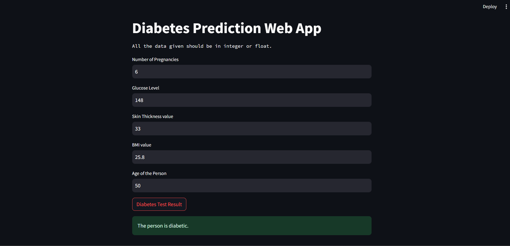

# 🩺 Diabetes Prediction Using Machine Learning

This project predicts whether a patient has diabetes using multiple machine learning models and a web app built with Streamlit. It includes data preprocessing, model training, evaluation, and deployment.

---

## ⚙️ Features

- Cleaned and preprocessed dataset

- Model training using:
  - KNN
  - Naive Bias
  - Logistic Regression
  - Decision Tree
  - Random Forest
  - Voting Classifier

- Hyperparameter tuning using GridSearchCV
- Use of Stratified k-fold for cross-validation
- Evaluation with classification metrics
- Model saved using both `pickle` and `skops`

- Interactive prediction web app using Streamlit

---

